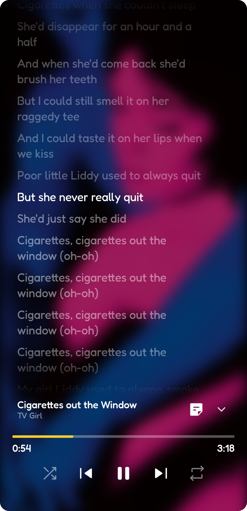
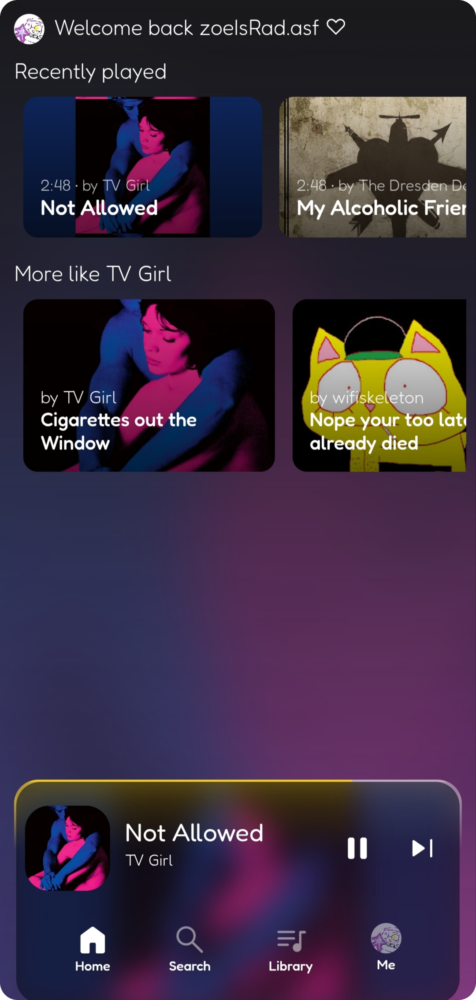
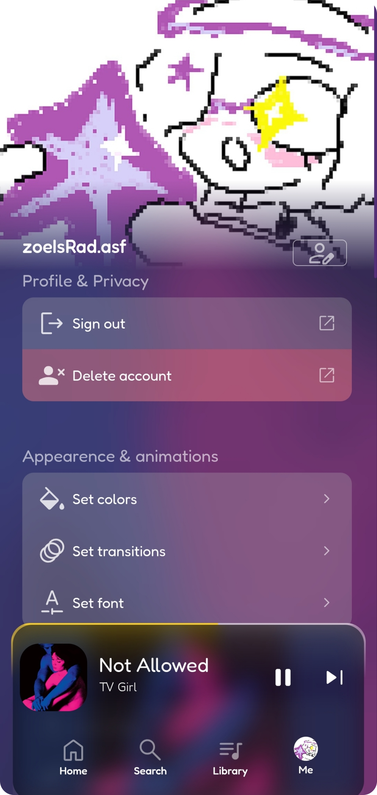

## All screenshots

## Description

### The Overall Vibe and Feeling

This music app has a distinct late-night, cozy, and dreamy indie vibe. It feels like sitting in a dark room illuminated only by neon lights or a computer screen. The mood is calm, deeply personal, and a bit moody - perfect for listening to alternative, breakcore, or indie pop music.
Colors and Lighting

    The Background: A smooth, deep gradient blending dark violet, midnight blue, and soft magenta. It looks like a twilight sky or a velvet curtain in a dimly lit room. Gets it's texture and color from a the blurred album art of the music currently playing.

    The Text: Mostly crisp white, slightly transparent, making it very easy to read against the dark screens.

Textures and Visual Style

    Frosted Glass: The app uses a lot of "glassmorphism." The bottom music player and navigation bars look like sheets of smoked, frosted glass floating over a blurry background. You can see soft shapes shifting underneath them.

    Smooth Curves: Every single corner is rounded - from the album art squares to the menu boxes and buttons. This gives the app a cozy, friendly, and modern texture that feels smooth to look at.

Screen Layouts and Elements
The Main Navigation & Mini-Player

    At the very bottom, a translucent tab houses four simple icons: Home, Search, Library, and Me (which features the user's profile).

    Floating right above this tab is a cute mini-player. It displays a tiny square of the album art, the song title, a thin glowing progress bar as a border, and simple play/skip buttons.

Home & Search Screens

    The Home Screen greets the user with a small heart next to their username. Music choices are laid out in a clean grid with large, colorful picture cards.

    The Search Screen features a friendly top bar that asks, "What vibe are you looking for?" Below it sit bright, quickly accessible filters for artists, music, albums or playlists.

Playlist & Library Views

    The Library organizes music using high-contrast, colorful rectangular badges (pink for music, orange for history).

    Playlists are stacked vertically in a neat, orderly list. Each playlist shows a miniature collage of four album covers clumped together, along with details like song counts and total playlist duration.

Full-Screen Player & Lyrics

    When a song plays full-screen, the album art takes center stage as a large, rounded square. The entire background becomes a heavily blurred, giant version of that same artwork, creating a beautiful color wash.

    On the Lyrics Screen, the background stays beautifully blurred while the lines of the song stack up vertically. The line currently being sung lights up in bright, bold white, while the past and upcoming lyrics fade slightly into a transparent tone.
