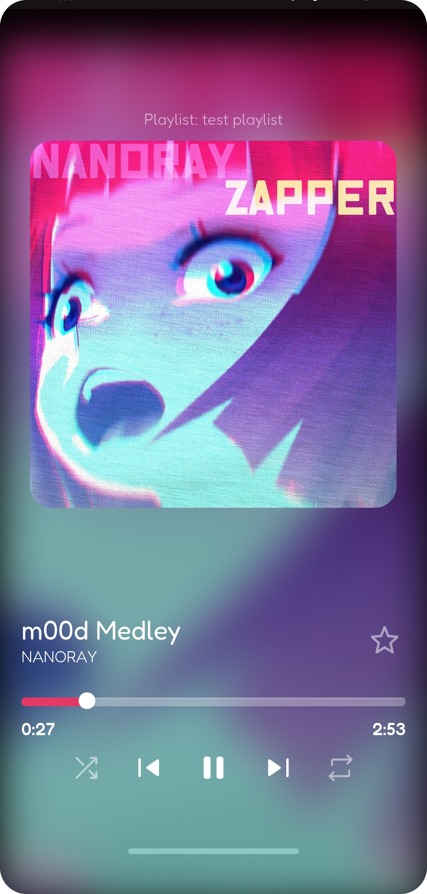
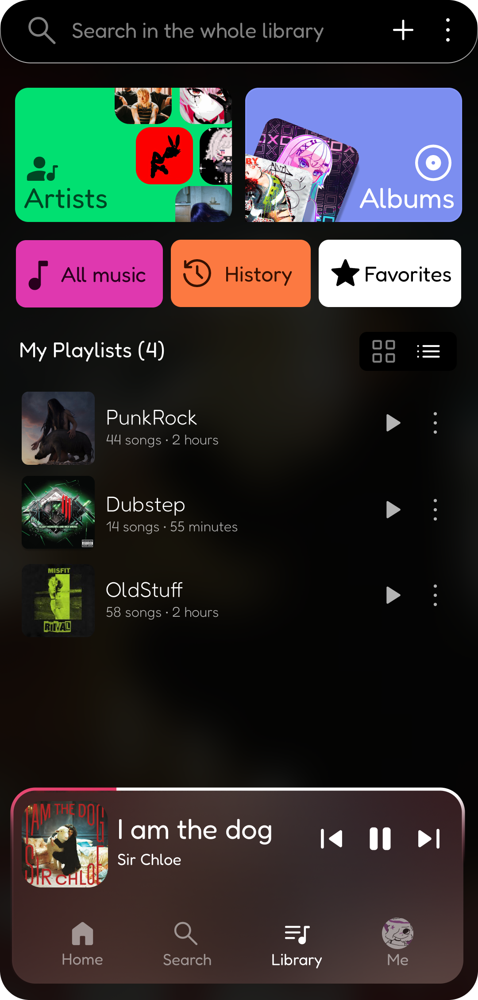
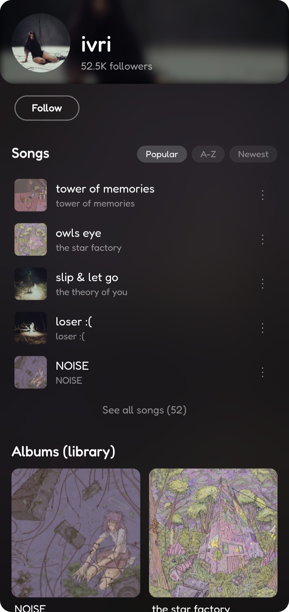
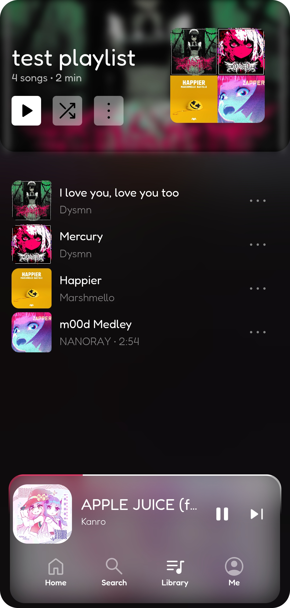

# starl

**art of sound for free**

*An open music client for Android ♡*

---

[User Guide](docs/user-guide.md) · [Developer Guide](docs/dev-guide.md) · [Roadmap](docs/roadmap.md) · [License](./LICENSE)

---

## What is this awesome looking thing?

Starl is a **free and open-source music client** — no ads, no algorithms you don't control, no subscriptions. You own your music and your data.

> **Alpha notice:** This is the first public release. The self-hosted backend is still in development — compiled releases connect to a public server in the meantime. Things may break. Feedback and contributions are welcome.

---

## Screenshots

---

## Features (v0.1.0)

- Full music player with queue management
- Shuffle, repeat, skip
- Persistent background playback
- Native music notification with playback controls
- Song and image caching — cached songs play offline automatically
- Library with playlists, favorites, and listening history
- Artist and album pages
- Track context menu (add to playlist, view album/artist, etc.)
- Search with recent history
- Account sync — your data follows you across devices

---

## Contributing

Open an issue before sending a PR — just to align on the direction first. No formal process yet.

---

## License

[PFF — Pure Freedom Forever](./LICENSE)

---

  i love you all! <a href="https://everm4iva.github.io">everm4iva</a>

