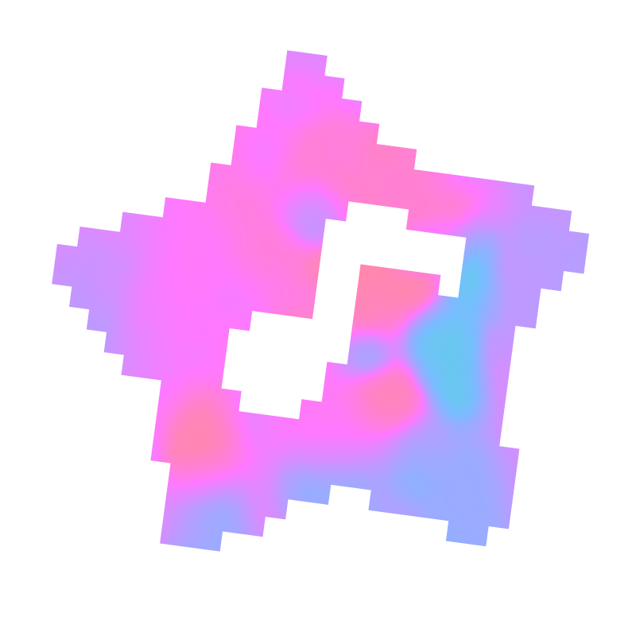
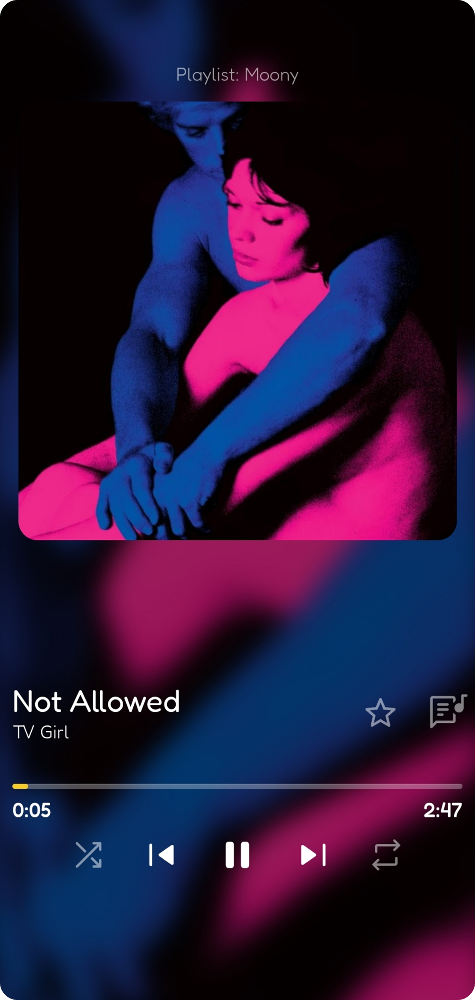
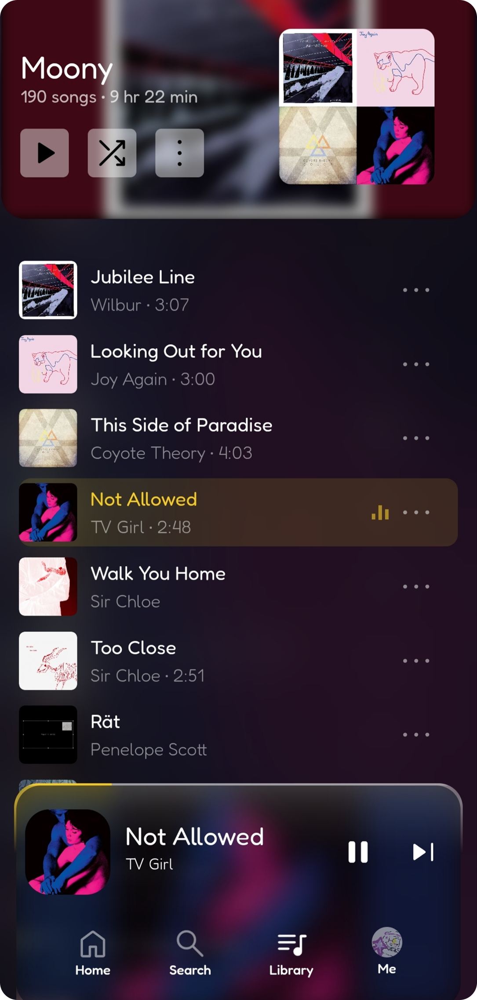
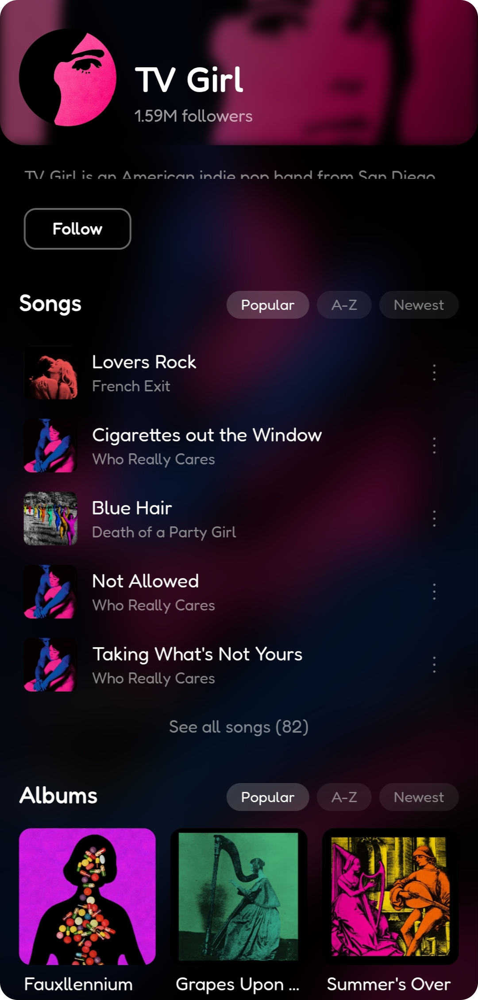
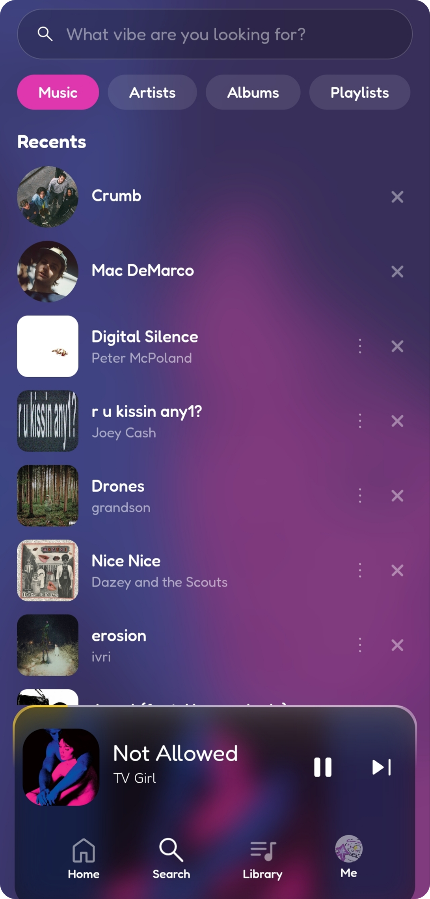

# starl

*An open, streaming music client ♡*

---

[User Guide](docs/user-guide.md) · [Developer Guide](docs/dev/dev-guide.md) · [Privacy & Data](privacy&data.md) · [FAQ](docs/faq.md) · [Changelog](./changelog.md) · [License](./LICENSE) · [Direct download](https://github.com/everm4iva/starl/releases/latest/download/starl-android.apk)

---

## What is this awesome looking thing?

Starl is a **free and open-source music client** - no ads, no algorithms you don't control, no subscriptions. You own your music and your data.
Also this is offline focused, so you can listen to your music without an internet connection smoothly.

---

## Screenshots

see more screenshots and design descriptions in the [screenshots](!readme-assets/screenshot.md).

---

## Features (beta 1.0)

- Full music player with smart queue management
- Shuffle, repeat, skip
- Lyrics support with auto-syncing and scrolling
- Storage management - delete songs, clear cache, and see how much space is used
- Recommendation system - discover new music based on your listening habits and costumize it fully!
- Import content from Spotify and Youtube natively!
- Export your library and playlists to a JSON file, and import it back later.
- Themes, fonts, animations and other stuff...
- Background playback / native music notification with playback controls
- Offline mode - works with cached data
- Library with playlists, favorites, artists, albums and listening history
- Track context menu (add to playlist, view album/artist, etc.)
- Search with recent history
- Account sync - your data follows you across devices
- Super fast streaming
- Self-hosting server environment - host your own server and stream your music from it, or use the public server provided by the app.
---

## Contributing

Open an issue or submit a pull request. All contributions are welcome, from bug fixes to new features. I recommend you to read existing issues from the creator to understand the overall structure.

Also, i added this thing in product hunt.. i donno what more to say..

Soon i will lauch a discord server for the community, to make it easier to talk to the community, share ideas, get help and even share your own music things!

Also because i want to stream the whole development process, it will be fun as heck!

---

## License

[PFF - Pure Freedom Forever](./LICENSE)

## Inspiration:
I took inspiration from many music apps, their functions, designs and the way they tell their message.
- Spotify / Youtube Music

- [vimusic](https://github.com/vfsfitvnm/ViMusic)
> My first taste of a free music client.

- [Harmony Music](https://github.com/anandnet/Harmony-Music)
> I still use it sometimes, i admire the work and dedication put into it. It's so simple. I love it.

- BubblePlay
> I know it's my own project, but still, i tried to make it as different as possible from other apps, but if it wasn't for this little try, starl would't exist.

---

  i love you all! <a href="https://everm4iva.github.io">everm4iva / zoeisrad.af</a> - and i love stars!

